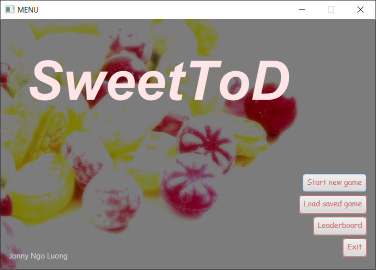
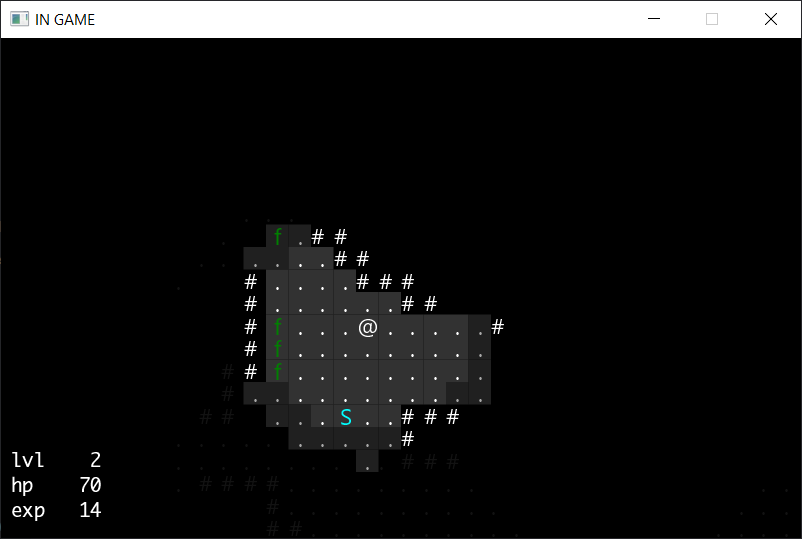
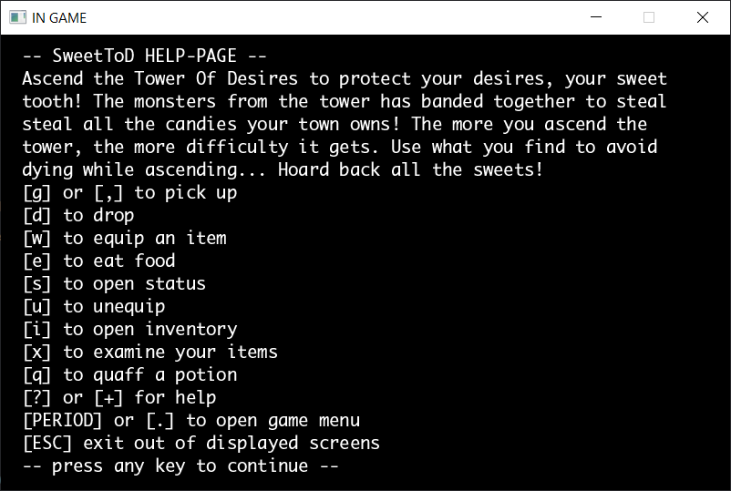

# SweetToD

Dette repoet er et spill for TDT4100 prosjektet våren 2020.

## Fine kommandoer
- `mvn install -DskipTests` - install lib
- `mvn clean compile` - compile lib and classes
- `mvn javafx:run` - run javafx application
- `mvn clean compile assembly:single` - build jar

NB: Test is running an old version of junit (and also poorly implemented), thus not working :c

## Preview

## Reminder av nøkkelpunkter

| Nøkkelpunkt                              | Beskrivelse                             |
| ---------------------------------------- | --------------------------------------- |
| Andel av karakter                        | 35% (appen) + 15% (dokumentasjon/teori) |
| Frist for godkjenning av prosjektplan    | 25. februar                             |
| Innleveringsfrist                        | 29. april                               |
| Demonstrasjonsfrist hos læringsassistent | 03. mai                                 |
| Gruppestørrelse                          | 1 eller 2 personer                      |

### Anbefalte perioder å jobbe med prosjektet

| Uke   | Fra  | Til  | Beskrivelse                                 |
| ----- | ---- | ---- | ------------------------------------------- |
| 7-8   | 14/2 | 25/2 | Grunnklasser og brukergrensesnitt           |
| 11    | 14/3 | 18/3 | Lagring of filhåndtering                    |
| 14    | 04/4 | 08/4 | Testing                                     |
| 16-17 | 19/4 | 29/4 | Fullføre appen med tilhørende dokumentasjon |

**_LYKKE TIL_**
